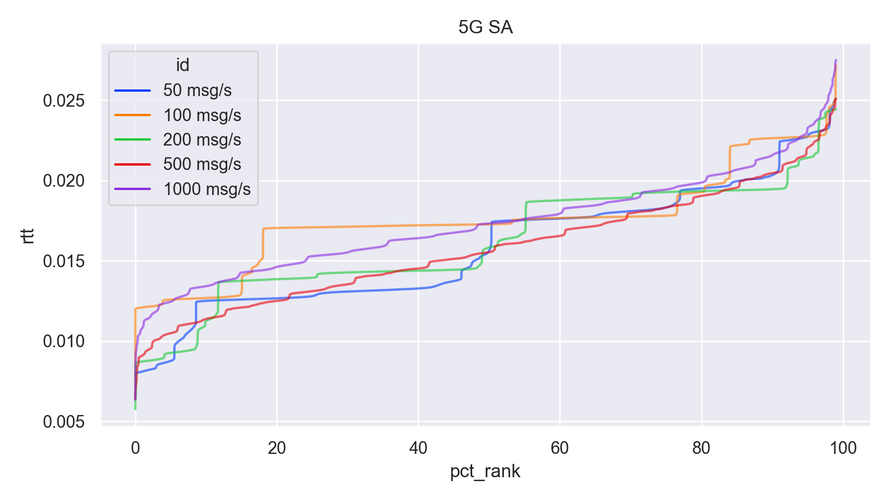
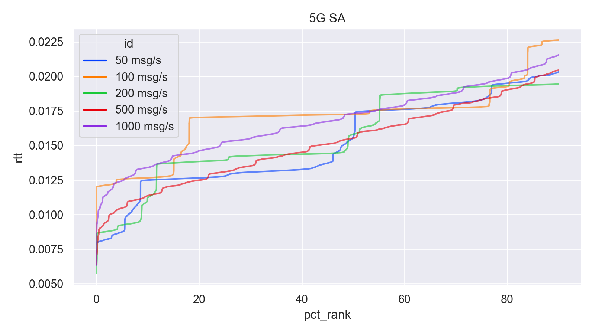
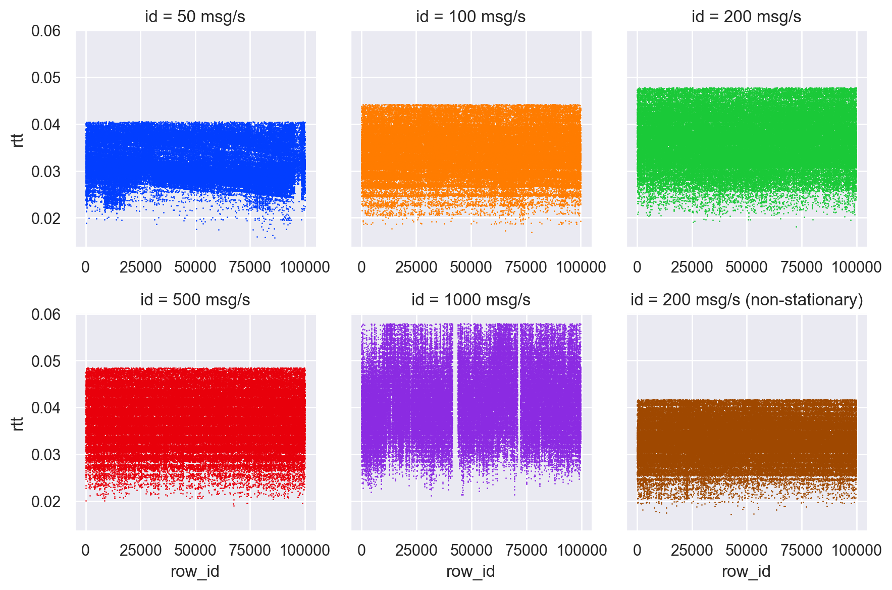
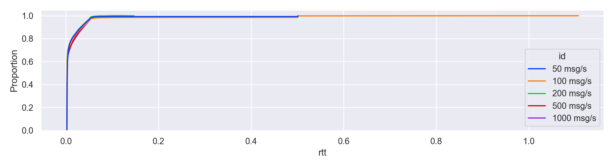

This document contains all diagrams generated for each measurement.

5G SA
-----

<figure>
<figcaption>5G SA (Rank to RTT, top 99%)</figcaption>
</figure>

<figure>
<figcaption>5G SA (Rank to RTT, top 95%)</figcaption>
</figure>

<figure>
<figcaption>5G SA (Rank to RTT, top 90%)</figcaption>
</figure>

<figure>
<figcaption>5G SA scatterplots</figcaption>
</figure>

<figure>
<figcaption>5G SA 6 ECDF</figcaption>
</figure>

<figure>
<figcaption>5G SA scatterplots (top 99%)</figcaption>
</figure>

<figure>
<figcaption>5G SA ECDF (top 99%)</figcaption>
</figure>

<figure>
<figcaption>5G SA scatterplots (top 95%)</figcaption>
</figure>

<figure>
<figcaption>5G SA ECDF (top 95%)</figcaption>
</figure>

<figure>
<figcaption>5G SA scatterplots (top 90%)</figcaption>
</figure>

<figure>
<figcaption>5G SA ECDF (top 90%)</figcaption>
</figure>

<table>
<caption>RTT statistics (5G SA)</caption>
<thead>
<tr class="header">
<th style="text-align: left;"></th>
<th style="text-align: right;">mean rtt</th>
<th style="text-align: right;">p95</th>
<th style="text-align: right;">p95 mean</th>
<th style="text-align: right;">p90</th>
<th style="text-align: right;">p90 mean</th>
<th style="text-align: right;">median</th>
</tr>
</thead>
<tbody>
<tr class="odd">
<td style="text-align: left;">50 msg/s</td>
<td style="text-align: right;">0.0159</td>
<td style="text-align: right;">0.0227</td>
<td style="text-align: right;">0.0155</td>
<td style="text-align: right;">0.0203</td>
<td style="text-align: right;">0.0151</td>
<td style="text-align: right;">0.0156</td>
</tr>
<tr class="even">
<td style="text-align: left;">100 msg/s</td>
<td style="text-align: right;">0.0176</td>
<td style="text-align: right;">0.0227</td>
<td style="text-align: right;">0.0173</td>
<td style="text-align: right;">0.0226</td>
<td style="text-align: right;">0.0170</td>
<td style="text-align: right;">0.0173</td>
</tr>
<tr class="odd">
<td style="text-align: left;">200 msg/s</td>
<td style="text-align: right;">0.0163</td>
<td style="text-align: right;">0.0214</td>
<td style="text-align: right;">0.0159</td>
<td style="text-align: right;">0.0194</td>
<td style="text-align: right;">0.0156</td>
<td style="text-align: right;">0.0158</td>
</tr>
<tr class="even">
<td style="text-align: left;">500 msg/s</td>
<td style="text-align: right;">0.0159</td>
<td style="text-align: right;">0.0220</td>
<td style="text-align: right;">0.0154</td>
<td style="text-align: right;">0.0205</td>
<td style="text-align: right;">0.0151</td>
<td style="text-align: right;">0.0155</td>
</tr>
<tr class="odd">
<td style="text-align: left;">1000 msg/s</td>
<td style="text-align: right;">0.0175</td>
<td style="text-align: right;">0.0233</td>
<td style="text-align: right;">0.0170</td>
<td style="text-align: right;">0.0216</td>
<td style="text-align: right;">0.0167</td>
<td style="text-align: right;">0.0173</td>
</tr>
</tbody>
</table>

<table>
<caption>Delivery statistics (5G SA)</caption>
<thead>
<tr class="header">
<th style="text-align: left;"></th>
<th style="text-align: right;">max. pending</th>
<th style="text-align: right;">non-unique</th>
<th style="text-align: right;">mean jitter</th>
<th style="text-align: right;">max. jitter</th>
<th style="text-align: right;">timed out</th>
</tr>
</thead>
<tbody>
<tr class="odd">
<td style="text-align: left;">50 msg/s</td>
<td style="text-align: right;">0.0856</td>
<td style="text-align: right;">24</td>
<td style="text-align: right;">0.0054</td>
<td style="text-align: right;">0.0656</td>
<td style="text-align: right;">0</td>
</tr>
<tr class="even">
<td style="text-align: left;">100 msg/s</td>
<td style="text-align: right;">0.0331</td>
<td style="text-align: right;">11431</td>
<td style="text-align: right;">0.0033</td>
<td style="text-align: right;">0.0231</td>
<td style="text-align: right;">0</td>
</tr>
<tr class="odd">
<td style="text-align: left;">200 msg/s</td>
<td style="text-align: right;">0.0298</td>
<td style="text-align: right;">12185</td>
<td style="text-align: right;">0.0048</td>
<td style="text-align: right;">0.0248</td>
<td style="text-align: right;">0</td>
</tr>
<tr class="even">
<td style="text-align: left;">500 msg/s</td>
<td style="text-align: right;">0.0259</td>
<td style="text-align: right;">9474</td>
<td style="text-align: right;">0.0030</td>
<td style="text-align: right;">0.0239</td>
<td style="text-align: right;">0</td>
</tr>
<tr class="odd">
<td style="text-align: left;">1000 msg/s</td>
<td style="text-align: right;">0.0230</td>
<td style="text-align: right;">10819</td>
<td style="text-align: right;">0.0016</td>
<td style="text-align: right;">0.0220</td>
<td style="text-align: right;">0</td>
</tr>
</tbody>
</table>

### Different Payload Sizes

<figure>
<figcaption>5G SA RTT ranked (top 99%)</figcaption>
</figure>

<figure>
<figcaption>5G SA RTT ranked (top 95%)</figcaption>
</figure>

<figure>
<figcaption>5G SA RTT ranked (top 90%)</figcaption>
</figure>

<figure>
<figcaption>5G SA message size scatterplots</figcaption>
</figure>

<figure>
<figcaption>5G SA message size ECDF</figcaption>
</figure>

<figure>
<figcaption>5G SA message size scatterplots (top 99%)</figcaption>
</figure>

<figure>
<figcaption>5G SA message size ECDF (top 99%)</figcaption>
</figure>

<figure>
<figcaption>5G SA message size scatterplots (top 95%)</figcaption>
</figure>

<figure>
<figcaption>5G SA message size ECDF (top 95%)</figcaption>
</figure>

<figure>
<figcaption>5G SA message size scatterplots (top 90%)</figcaption>
</figure>

<figure>
<figcaption>5G SA message size ECDF (top 90%)</figcaption>
</figure>

<table>
<caption>RTT statistics (5G SA | Size)</caption>
<thead>
<tr class="header">
<th style="text-align: left;"></th>
<th style="text-align: right;">mean rtt</th>
<th style="text-align: right;">p95</th>
<th style="text-align: right;">p95 mean</th>
<th style="text-align: right;">p90</th>
<th style="text-align: right;">p90 mean</th>
<th style="text-align: right;">median</th>
</tr>
</thead>
<tbody>
<tr class="odd">
<td style="text-align: left;">1344 B/msg</td>
<td style="text-align: right;">0.0176</td>
<td style="text-align: right;">0.0227</td>
<td style="text-align: right;">0.0173</td>
<td style="text-align: right;">0.0226</td>
<td style="text-align: right;">0.0170</td>
<td style="text-align: right;">0.0173</td>
</tr>
<tr class="even">
<td style="text-align: left;">672 B/msg</td>
<td style="text-align: right;">0.0167</td>
<td style="text-align: right;">0.0219</td>
<td style="text-align: right;">0.0163</td>
<td style="text-align: right;">0.0205</td>
<td style="text-align: right;">0.0160</td>
<td style="text-align: right;">0.0156</td>
</tr>
<tr class="odd">
<td style="text-align: left;">336 B/msg</td>
<td style="text-align: right;">0.0155</td>
<td style="text-align: right;">0.0198</td>
<td style="text-align: right;">0.0151</td>
<td style="text-align: right;">0.0195</td>
<td style="text-align: right;">0.0148</td>
<td style="text-align: right;">0.0147</td>
</tr>
</tbody>
</table>

<table>
<caption>Delivery statistics (5G SA | Size)</caption>
<thead>
<tr class="header">
<th style="text-align: left;"></th>
<th style="text-align: right;">max. pending</th>
<th style="text-align: right;">non-unique</th>
<th style="text-align: right;">mean jitter</th>
<th style="text-align: right;">max. jitter</th>
<th style="text-align: right;">timed out</th>
</tr>
</thead>
<tbody>
<tr class="odd">
<td style="text-align: left;">1344 B/msg</td>
<td style="text-align: right;">0.0331</td>
<td style="text-align: right;">11431</td>
<td style="text-align: right;">0.0033</td>
<td style="text-align: right;">0.0231</td>
<td style="text-align: right;">0</td>
</tr>
<tr class="even">
<td style="text-align: left;">672 B/msg</td>
<td style="text-align: right;">0.0322</td>
<td style="text-align: right;">10472</td>
<td style="text-align: right;">0.0039</td>
<td style="text-align: right;">0.0222</td>
<td style="text-align: right;">0</td>
</tr>
<tr class="odd">
<td style="text-align: left;">336 B/msg</td>
<td style="text-align: right;">0.0375</td>
<td style="text-align: right;">8188</td>
<td style="text-align: right;">0.0040</td>
<td style="text-align: right;">0.0275</td>
<td style="text-align: right;">0</td>
</tr>
</tbody>
</table>

5G NSA
------

<figure>
<figcaption>5G NSA (Rank to RTT, top 95%)</figcaption>
</figure>

<figure>
<figcaption>5 NSA (Rank to RTT, top 95%)</figcaption>
</figure>

<figure>
<figcaption>5 NSA (Rank to RTT, top 90%)</figcaption>
</figure>

<figure>
<figcaption>5G NSA scatterplots</figcaption>
</figure>

<figure>
<figcaption>5G NSA ECDF</figcaption>
</figure>

<figure>
<figcaption>5G NSA scatterplots (top 99%)</figcaption>
</figure>

<figure>
<figcaption>5G NSA ECDF (top 99%)</figcaption>
</figure>

<figure>
<figcaption>5G NSA scatterplots (top 95%)</figcaption>
</figure>

<figure>
<figcaption>5G NSA ECDF (top 95%)</figcaption>
</figure>

<figure>
<figcaption>5G NSA scatterplots (top 90%)</figcaption>
</figure>

<figure>
<figcaption>5G NSA ECDF (top 90%)</figcaption>
</figure>

<table>
<caption>RTT statistics (5G NSA)</caption>
<thead>
<tr class="header">
<th style="text-align: left;"></th>
<th style="text-align: right;">mean rtt</th>
<th style="text-align: right;">p95</th>
<th style="text-align: right;">p95 mean</th>
<th style="text-align: right;">p90</th>
<th style="text-align: right;">p90 mean</th>
<th style="text-align: right;">median</th>
</tr>
</thead>
<tbody>
<tr class="odd">
<td style="text-align: left;">50 msg/s</td>
<td style="text-align: right;">0.0356</td>
<td style="text-align: right;">0.0453</td>
<td style="text-align: right;">0.0322</td>
<td style="text-align: right;">0.0405</td>
<td style="text-align: right;">0.0316</td>
<td style="text-align: right;">0.0314</td>
</tr>
<tr class="even">
<td style="text-align: left;">100 msg/s</td>
<td style="text-align: right;">0.0363</td>
<td style="text-align: right;">0.0483</td>
<td style="text-align: right;">0.0346</td>
<td style="text-align: right;">0.0442</td>
<td style="text-align: right;">0.0340</td>
<td style="text-align: right;">0.0348</td>
</tr>
<tr class="odd">
<td style="text-align: left;">200 msg/s</td>
<td style="text-align: right;">0.0397</td>
<td style="text-align: right;">0.0532</td>
<td style="text-align: right;">0.0372</td>
<td style="text-align: right;">0.0478</td>
<td style="text-align: right;">0.0365</td>
<td style="text-align: right;">0.0372</td>
</tr>
<tr class="even">
<td style="text-align: left;">500 msg/s</td>
<td style="text-align: right;">0.0397</td>
<td style="text-align: right;">0.0523</td>
<td style="text-align: right;">0.0380</td>
<td style="text-align: right;">0.0485</td>
<td style="text-align: right;">0.0373</td>
<td style="text-align: right;">0.0383</td>
</tr>
<tr class="odd">
<td style="text-align: left;">1000 msg/s</td>
<td style="text-align: right;">0.0570</td>
<td style="text-align: right;">0.1087</td>
<td style="text-align: right;">0.0425</td>
<td style="text-align: right;">0.0579</td>
<td style="text-align: right;">0.0411</td>
<td style="text-align: right;">0.0416</td>
</tr>
<tr class="even">
<td style="text-align: left;">200 msg/smoving</td>
<td style="text-align: right;">0.0344</td>
<td style="text-align: right;">0.0443</td>
<td style="text-align: right;">0.0335</td>
<td style="text-align: right;">0.0417</td>
<td style="text-align: right;">0.0330</td>
<td style="text-align: right;">0.0336</td>
</tr>
</tbody>
</table>

<table>
<caption>Delivery statistics (5G NSA)</caption>
<thead>
<tr class="header">
<th style="text-align: left;"></th>
<th style="text-align: right;">max. pending</th>
<th style="text-align: right;">non-unique</th>
<th style="text-align: right;">mean jitter</th>
<th style="text-align: right;">max. jitter</th>
<th style="text-align: right;">timed out</th>
</tr>
</thead>
<tbody>
<tr class="odd">
<td style="text-align: left;">50 msg/s</td>
<td style="text-align: right;">0.4914</td>
<td style="text-align: right;">2222</td>
<td style="text-align: right;">0.0069</td>
<td style="text-align: right;">0.4714</td>
<td style="text-align: right;">98</td>
</tr>
<tr class="even">
<td style="text-align: left;">100 msg/s</td>
<td style="text-align: right;">0.2692</td>
<td style="text-align: right;">7854</td>
<td style="text-align: right;">0.0056</td>
<td style="text-align: right;">0.2592</td>
<td style="text-align: right;">0</td>
</tr>
<tr class="odd">
<td style="text-align: left;">200 msg/s</td>
<td style="text-align: right;">0.1497</td>
<td style="text-align: right;">15835</td>
<td style="text-align: right;">0.0047</td>
<td style="text-align: right;">0.1414</td>
<td style="text-align: right;">4</td>
</tr>
<tr class="even">
<td style="text-align: left;">500 msg/s</td>
<td style="text-align: right;">0.1313</td>
<td style="text-align: right;">14515</td>
<td style="text-align: right;">0.0030</td>
<td style="text-align: right;">0.1293</td>
<td style="text-align: right;">0</td>
</tr>
<tr class="odd">
<td style="text-align: left;">1000 msg/s</td>
<td style="text-align: right;">0.1281</td>
<td style="text-align: right;">16146</td>
<td style="text-align: right;">0.0017</td>
<td style="text-align: right;">0.1241</td>
<td style="text-align: right;">1343</td>
</tr>
<tr class="even">
<td style="text-align: left;">200 msg/smoving</td>
<td style="text-align: right;">0.1058</td>
<td style="text-align: right;">14581</td>
<td style="text-align: right;">0.0039</td>
<td style="text-align: right;">0.0987</td>
<td style="text-align: right;">0</td>
</tr>
</tbody>
</table>

### Different Payload Sizes

<figure>
<figcaption>5G NSA RTT ranked (top 99%)</figcaption>
</figure>

<figure>
<figcaption>5G NSA RTT ranked (top 95%)</figcaption>
</figure>

<figure>
<figcaption>5G NSA RTT ranked (top 90%)</figcaption>
</figure>

<figure>
<figcaption>5G NSA message size scatterplots</figcaption>
</figure>

<figure>
<figcaption>5G NSA message size ECDF</figcaption>
</figure>

<figure>
<figcaption>5G NSA message size scatterplots (top 99%)</figcaption>
</figure>

<figure>
<figcaption>5G NSA message size ECDF (top 99%)</figcaption>
</figure>

<figure>
<figcaption>5G NSA message size scatterplots (top 95%)</figcaption>
</figure>

<figure>
<figcaption>5G NSA message size ECDF (top 95%)</figcaption>
</figure>

<figure>
<figcaption>5G NSA message size scatterplots (top 90%)</figcaption>
</figure>

<figure>
<figcaption>5G NSA message size ECDF (top 90%)</figcaption>
</figure>

<table>
<caption>RTT statistics (5G NSA | Size)</caption>
<thead>
<tr class="header">
<th style="text-align: left;"></th>
<th style="text-align: right;">mean rtt</th>
<th style="text-align: right;">p95</th>
<th style="text-align: right;">p95 mean</th>
<th style="text-align: right;">p90</th>
<th style="text-align: right;">p90 mean</th>
<th style="text-align: right;">median</th>
</tr>
</thead>
<tbody>
<tr class="odd">
<td style="text-align: left;">1344 B/msg</td>
<td style="text-align: right;">0.0363</td>
<td style="text-align: right;">0.0483</td>
<td style="text-align: right;">0.0346</td>
<td style="text-align: right;">0.0442</td>
<td style="text-align: right;">0.0340</td>
<td style="text-align: right;">0.0348</td>
</tr>
<tr class="even">
<td style="text-align: left;">672 B/msg</td>
<td style="text-align: right;">0.0285</td>
<td style="text-align: right;">0.0376</td>
<td style="text-align: right;">0.0277</td>
<td style="text-align: right;">0.0351</td>
<td style="text-align: right;">0.0272</td>
<td style="text-align: right;">0.0277</td>
</tr>
<tr class="odd">
<td style="text-align: left;">336 B/msg</td>
<td style="text-align: right;">0.0312</td>
<td style="text-align: right;">0.0382</td>
<td style="text-align: right;">0.0283</td>
<td style="text-align: right;">0.0350</td>
<td style="text-align: right;">0.0278</td>
<td style="text-align: right;">0.0285</td>
</tr>
</tbody>
</table>

<table>
<caption>Delivery statistics (5G NSA | Size)</caption>
<thead>
<tr class="header">
<th style="text-align: left;"></th>
<th style="text-align: right;">max. pending</th>
<th style="text-align: right;">non-unique</th>
<th style="text-align: right;">mean jitter</th>
<th style="text-align: right;">max. jitter</th>
<th style="text-align: right;">timed out</th>
</tr>
</thead>
<tbody>
<tr class="odd">
<td style="text-align: left;">1344 B/msg</td>
<td style="text-align: right;">0.2692</td>
<td style="text-align: right;">7854</td>
<td style="text-align: right;">0.0056</td>
<td style="text-align: right;">0.2592</td>
<td style="text-align: right;">0</td>
</tr>
<tr class="even">
<td style="text-align: left;">672 B/msg</td>
<td style="text-align: right;">0.0939</td>
<td style="text-align: right;">2602</td>
<td style="text-align: right;">0.0047</td>
<td style="text-align: right;">0.0846</td>
<td style="text-align: right;">0</td>
</tr>
<tr class="odd">
<td style="text-align: left;">336 B/msg</td>
<td style="text-align: right;">0.1456</td>
<td style="text-align: right;">4672</td>
<td style="text-align: right;">0.0045</td>
<td style="text-align: right;">0.1356</td>
<td style="text-align: right;">0</td>
</tr>
</tbody>
</table>

Wi-Fi 5
-------

<figure>
<figcaption>Wi-Fi 5 (Rank to RTT, top 99%)</figcaption>
</figure>

<figure>
<figcaption>Wi-Fi 5 (Rank to RTT, top 95%)</figcaption>
</figure>

<figure>
<figcaption>Wi-Fi 5 (Rank to RTT, top 90%)</figcaption>
</figure>

<figure>
<figcaption>Wi-Fi 5 scatterplots</figcaption>
</figure>

<figure>
<figcaption>Wi-Fi 5 ECDF</figcaption>
</figure>

<figure>
<figcaption>Wi-Fi 5 scatterplots (top 99%)</figcaption>
</figure>

<figure>
<figcaption>Wi-Fi 5 ECDF (top 99%)</figcaption>
</figure>

<figure>
<figcaption>Wi-Fi 5 scatterplots (top 95%)</figcaption>
</figure>

<figure>
<figcaption>Wi-Fi 5 ECDF (top 95%)</figcaption>
</figure>

<figure>
<figcaption>Wi-Fi 5 scatterplots (top 90%)</figcaption>
</figure>

<figure>
<figcaption>Wi-Fi 5 ECDF (top 90%)</figcaption>
</figure>

<table>
<caption>Wi-Fi 5 RTT statistics</caption>
<thead>
<tr class="header">
<th style="text-align: left;"></th>
<th style="text-align: right;">mean rtt</th>
<th style="text-align: right;">p95</th>
<th style="text-align: right;">p95 mean</th>
<th style="text-align: right;">p90</th>
<th style="text-align: right;">p90 mean</th>
<th style="text-align: right;">median</th>
</tr>
</thead>
<tbody>
<tr class="odd">
<td style="text-align: left;">50 msg/s</td>
<td style="text-align: right;">0.0124</td>
<td style="text-align: right;">0.0452</td>
<td style="text-align: right;">0.0072</td>
<td style="text-align: right;">0.0323</td>
<td style="text-align: right;">0.0054</td>
<td style="text-align: right;">0.0028</td>
</tr>
<tr class="even">
<td style="text-align: left;">100 msg/s</td>
<td style="text-align: right;">0.0169</td>
<td style="text-align: right;">0.0483</td>
<td style="text-align: right;">0.0074</td>
<td style="text-align: right;">0.0351</td>
<td style="text-align: right;">0.0055</td>
<td style="text-align: right;">0.0023</td>
</tr>
<tr class="odd">
<td style="text-align: left;">200 msg/s</td>
<td style="text-align: right;">0.0090</td>
<td style="text-align: right;">0.0444</td>
<td style="text-align: right;">0.0067</td>
<td style="text-align: right;">0.0315</td>
<td style="text-align: right;">0.0049</td>
<td style="text-align: right;">0.0022</td>
</tr>
<tr class="even">
<td style="text-align: left;">500 msg/s</td>
<td style="text-align: right;">0.0104</td>
<td style="text-align: right;">0.0473</td>
<td style="text-align: right;">0.0080</td>
<td style="text-align: right;">0.0360</td>
<td style="text-align: right;">0.0061</td>
<td style="text-align: right;">0.0025</td>
</tr>
<tr class="odd">
<td style="text-align: left;">1000 msg/s</td>
<td style="text-align: right;">0.0106</td>
<td style="text-align: right;">0.0487</td>
<td style="text-align: right;">0.0082</td>
<td style="text-align: right;">0.0379</td>
<td style="text-align: right;">0.0063</td>
<td style="text-align: right;">0.0021</td>
</tr>
</tbody>
</table>

<table>
<caption>Wi-Fi 5 delivery statistics</caption>
<thead>
<tr class="header">
<th style="text-align: left;"></th>
<th style="text-align: right;">max. pending</th>
<th style="text-align: right;">non-unique</th>
<th style="text-align: right;">mean jitter</th>
<th style="text-align: right;">max. jitter</th>
<th style="text-align: right;">timed out</th>
</tr>
</thead>
<tbody>
<tr class="odd">
<td style="text-align: left;">50 msg/s</td>
<td style="text-align: right;">0.5189</td>
<td style="text-align: right;">4512</td>
<td style="text-align: right;">0.0086</td>
<td style="text-align: right;">0.4989</td>
<td style="text-align: right;">649</td>
</tr>
<tr class="even">
<td style="text-align: left;">100 msg/s</td>
<td style="text-align: right;">0.5809</td>
<td style="text-align: right;">4612</td>
<td style="text-align: right;">0.0053</td>
<td style="text-align: right;">0.5609</td>
<td style="text-align: right;">1493</td>
</tr>
<tr class="odd">
<td style="text-align: left;">200 msg/s</td>
<td style="text-align: right;">0.1336</td>
<td style="text-align: right;">4383</td>
<td style="text-align: right;">0.0030</td>
<td style="text-align: right;">0.1286</td>
<td style="text-align: right;">0</td>
</tr>
<tr class="even">
<td style="text-align: left;">500 msg/s</td>
<td style="text-align: right;">0.1308</td>
<td style="text-align: right;">6416</td>
<td style="text-align: right;">0.0016</td>
<td style="text-align: right;">0.1288</td>
<td style="text-align: right;">0</td>
</tr>
<tr class="odd">
<td style="text-align: left;">1000 msg/s</td>
<td style="text-align: right;">0.1072</td>
<td style="text-align: right;">7916</td>
<td style="text-align: right;">0.0009</td>
<td style="text-align: right;">0.1062</td>
<td style="text-align: right;">0</td>
</tr>
</tbody>
</table>

### Different Payload Sizes

<figure>
<figcaption>Wi-Fi 5 RTT ranked (top 99%)</figcaption>
</figure>

<figure>
<figcaption>Wi-Fi 5 RTT ranked (top 95%)</figcaption>
</figure>

<figure>
<figcaption>Wi-Fi 5 RTT ranked (top 90%)</figcaption>
</figure>

<figure>
<figcaption>Wi-Fi 5 message size scatterplots</figcaption>
</figure>

<figure>
<figcaption>Wi-Fi 5 message size ECDF</figcaption>
</figure>

<figure>
<figcaption>Wi-Fi 5 message size scatterplots (top 99%)</figcaption>
</figure>

<figure>
<figcaption>Wi-Fi 5 message size ECDF (top 99%)</figcaption>
</figure>

<figure>
<figcaption>Wi-Fi 5 message size scatterplots (top 95%)</figcaption>
</figure>

<figure>
<figcaption>Wi-Fi 5 message size ECDF (top 95%)</figcaption>
</figure>

<figure>
<figcaption>Wi-Fi 5 message size scatterplots (top 90%)</figcaption>
</figure>

<figure>
<figcaption>Wi-Fi 5 message size ECDF (top 90%)</figcaption>
</figure>

<table>
<caption>RTT statistics (Wi-Fi 5 | Size)</caption>
<thead>
<tr class="header">
<th style="text-align: left;"></th>
<th style="text-align: right;">mean rtt</th>
<th style="text-align: right;">p95</th>
<th style="text-align: right;">p95 mean</th>
<th style="text-align: right;">p90</th>
<th style="text-align: right;">p90 mean</th>
<th style="text-align: right;">median</th>
</tr>
</thead>
<tbody>
<tr class="odd">
<td style="text-align: left;">1344 B/msg</td>
<td style="text-align: right;">0.0169</td>
<td style="text-align: right;">0.0483</td>
<td style="text-align: right;">0.0074</td>
<td style="text-align: right;">0.0351</td>
<td style="text-align: right;">0.0055</td>
<td style="text-align: right;">0.0023</td>
</tr>
<tr class="even">
<td style="text-align: left;">672 B/msg</td>
<td style="text-align: right;">0.0227</td>
<td style="text-align: right;">0.0644</td>
<td style="text-align: right;">0.0104</td>
<td style="text-align: right;">0.0456</td>
<td style="text-align: right;">0.0080</td>
<td style="text-align: right;">0.0027</td>
</tr>
<tr class="odd">
<td style="text-align: left;">336 B/msg</td>
<td style="text-align: right;">0.0162</td>
<td style="text-align: right;">0.0491</td>
<td style="text-align: right;">0.0074</td>
<td style="text-align: right;">0.0350</td>
<td style="text-align: right;">0.0055</td>
<td style="text-align: right;">0.0022</td>
</tr>
</tbody>
</table>

<table>
<caption>Delivery statistics (Wi-Fi 5 | Size)</caption>
<thead>
<tr class="header">
<th style="text-align: left;"></th>
<th style="text-align: right;">max. pending</th>
<th style="text-align: right;">non-unique</th>
<th style="text-align: right;">mean jitter</th>
<th style="text-align: right;">max. jitter</th>
<th style="text-align: right;">timed out</th>
</tr>
</thead>
<tbody>
<tr class="odd">
<td style="text-align: left;">1344 B/msg</td>
<td style="text-align: right;">0.5809</td>
<td style="text-align: right;">4612</td>
<td style="text-align: right;">0.0053</td>
<td style="text-align: right;">0.5609</td>
<td style="text-align: right;">1493</td>
</tr>
<tr class="even">
<td style="text-align: left;">672 B/msg</td>
<td style="text-align: right;">0.7402</td>
<td style="text-align: right;">5288</td>
<td style="text-align: right;">0.0065</td>
<td style="text-align: right;">0.7302</td>
<td style="text-align: right;">1570</td>
</tr>
<tr class="odd">
<td style="text-align: left;">336 B/msg</td>
<td style="text-align: right;">0.5086</td>
<td style="text-align: right;">4471</td>
<td style="text-align: right;">0.0054</td>
<td style="text-align: right;">0.4986</td>
<td style="text-align: right;">1286</td>
</tr>
</tbody>
</table>

Wi-Fi 6
-------

<figure>
<figcaption>Wi-Fi 6 (Rank to RTT, top 99%)</figcaption>
</figure>

<figure>
<figcaption>Wi-Fi 6 (Rank to RTT, top 95%)</figcaption>
</figure>

<figure>
<figcaption>Wi-Fi 6 (Rank to RTT, top 90%)</figcaption>
</figure>

<figure>
<figcaption>Wi-Fi 6 scatterplots</figcaption>
</figure>

<figure>
<figcaption>Wi-Fi 6 ECDF</figcaption>
</figure>

<figure>
<figcaption>Wi-Fi 6 scatterplots (top 99%)</figcaption>
</figure>

<figure>
<figcaption>Wi-Fi 6 ECDF (top 99%)</figcaption>
</figure>

<figure>
<figcaption>Wi-Fi 6 scatterplots (top 95%)</figcaption>
</figure>

<figure>
<figcaption>Wi-Fi 6 ECDF (top 95%)</figcaption>
</figure>

<figure>
<figcaption>Wi-Fi 6 scatterplots (top 90%)</figcaption>
</figure>

<figure>
<figcaption>Wi-Fi 6 ECDF (top 90%)</figcaption>
</figure>

<table>
<caption>RTT statistics (Wi-Fi 6)</caption>
<thead>
<tr class="header">
<th style="text-align: left;"></th>
<th style="text-align: right;">mean rtt</th>
<th style="text-align: right;">p95</th>
<th style="text-align: right;">p95 mean</th>
<th style="text-align: right;">p90</th>
<th style="text-align: right;">p90 mean</th>
<th style="text-align: right;">median</th>
</tr>
</thead>
<tbody>
<tr class="odd">
<td style="text-align: left;">100 msg/s</td>
<td style="text-align: right;">0.0056</td>
<td style="text-align: right;">0.0121</td>
<td style="text-align: right;">0.0044</td>
<td style="text-align: right;">0.0085</td>
<td style="text-align: right;">0.0041</td>
<td style="text-align: right;">0.0038</td>
</tr>
<tr class="even">
<td style="text-align: left;">200 msg/s</td>
<td style="text-align: right;">0.0055</td>
<td style="text-align: right;">0.0123</td>
<td style="text-align: right;">0.0041</td>
<td style="text-align: right;">0.0081</td>
<td style="text-align: right;">0.0038</td>
<td style="text-align: right;">0.0034</td>
</tr>
<tr class="odd">
<td style="text-align: left;">500 msg/s</td>
<td style="text-align: right;">0.0098</td>
<td style="text-align: right;">0.0195</td>
<td style="text-align: right;">0.0053</td>
<td style="text-align: right;">0.0115</td>
<td style="text-align: right;">0.0048</td>
<td style="text-align: right;">0.0046</td>
</tr>
<tr class="even">
<td style="text-align: left;">1000 msg/s</td>
<td style="text-align: right;">0.0163</td>
<td style="text-align: right;">0.0597</td>
<td style="text-align: right;">0.0092</td>
<td style="text-align: right;">0.0267</td>
<td style="text-align: right;">0.0075</td>
<td style="text-align: right;">0.0061</td>
</tr>
</tbody>
</table>

<table>
<caption>Delivery statistics (Wi-Fi 6)</caption>
<thead>
<tr class="header">
<th style="text-align: left;"></th>
<th style="text-align: right;">max. pending</th>
<th style="text-align: right;">non-unique</th>
<th style="text-align: right;">mean jitter</th>
<th style="text-align: right;">max. jitter</th>
<th style="text-align: right;">timed out</th>
</tr>
</thead>
<tbody>
<tr class="odd">
<td style="text-align: left;">100 msg/s</td>
<td style="text-align: right;">0.4198</td>
<td style="text-align: right;">1075</td>
<td style="text-align: right;">0.0025</td>
<td style="text-align: right;">0.3798</td>
<td style="text-align: right;">0</td>
</tr>
<tr class="even">
<td style="text-align: left;">200 msg/s</td>
<td style="text-align: right;">0.1654</td>
<td style="text-align: right;">2575</td>
<td style="text-align: right;">0.0018</td>
<td style="text-align: right;">0.1604</td>
<td style="text-align: right;">0</td>
</tr>
<tr class="odd">
<td style="text-align: left;">500 msg/s</td>
<td style="text-align: right;">0.1317</td>
<td style="text-align: right;">8479</td>
<td style="text-align: right;">0.0017</td>
<td style="text-align: right;">0.1263</td>
<td style="text-align: right;">192</td>
</tr>
<tr class="even">
<td style="text-align: left;">1000 msg/s</td>
<td style="text-align: right;">0.2476</td>
<td style="text-align: right;">15168</td>
<td style="text-align: right;">0.0015</td>
<td style="text-align: right;">0.2468</td>
<td style="text-align: right;">134</td>
</tr>
</tbody>
</table>

### Different Payload Sizes

<figure>
<figcaption>Wi-Fi 6 RTT ranked (top 99%)</figcaption>
</figure>

<figure>
<figcaption>Wi-Fi 6 RTT ranked (top 95%)</figcaption>
</figure>

<figure>
<figcaption>Wi-Fi 6 RTT ranked (top 90%)</figcaption>
</figure>

<figure>
<figcaption>Wi-Fi 6 message size scatterplots</figcaption>
</figure>

<figure>
<figcaption>Wi-Fi 6 message size ECDF</figcaption>
</figure>

<figure>
<figcaption>Wi-Fi 6 message size scatterplots (top 99%)</figcaption>
</figure>

<figure>
<figcaption>Wi-Fi 6 message size ECDF (top 99%)</figcaption>
</figure>

<figure>
<figcaption>Wi-Fi 6 message size scatterplots (top 95%)</figcaption>
</figure>

<figure>
<figcaption>Wi-Fi 6 message size ECDF (top 95%)</figcaption>
</figure>

<figure>
<figcaption>Wi-Fi 6 message size scatterplots (top 90%)</figcaption>
</figure>

<figure>
<figcaption>Wi-Fi 6 message size ECDF (top 90%)</figcaption>
</figure>

<table>
<caption>RTT statistics (Wi-Fi 6 | Size)</caption>
<thead>
<tr class="header">
<th style="text-align: left;"></th>
<th style="text-align: right;">mean rtt</th>
<th style="text-align: right;">p95</th>
<th style="text-align: right;">p95 mean</th>
<th style="text-align: right;">p90</th>
<th style="text-align: right;">p90 mean</th>
<th style="text-align: right;">median</th>
</tr>
</thead>
<tbody>
<tr class="odd">
<td style="text-align: left;">1344 B/msg</td>
<td style="text-align: right;">0.0056</td>
<td style="text-align: right;">0.0121</td>
<td style="text-align: right;">0.0044</td>
<td style="text-align: right;">0.0085</td>
<td style="text-align: right;">0.0041</td>
<td style="text-align: right;">0.0038</td>
</tr>
<tr class="even">
<td style="text-align: left;">672 B/msg</td>
<td style="text-align: right;">0.0064</td>
<td style="text-align: right;">0.0157</td>
<td style="text-align: right;">0.0044</td>
<td style="text-align: right;">0.0092</td>
<td style="text-align: right;">0.0040</td>
<td style="text-align: right;">0.0036</td>
</tr>
<tr class="odd">
<td style="text-align: left;">336 B/msg</td>
<td style="text-align: right;">0.0042</td>
<td style="text-align: right;">0.0092</td>
<td style="text-align: right;">0.0036</td>
<td style="text-align: right;">0.0073</td>
<td style="text-align: right;">0.0034</td>
<td style="text-align: right;">0.0031</td>
</tr>
</tbody>
</table>

<table>
<caption>Delivery statistics (Wi-Fi 6 | Size)</caption>
<thead>
<tr class="header">
<th style="text-align: left;"></th>
<th style="text-align: right;">max. pending</th>
<th style="text-align: right;">non-unique</th>
<th style="text-align: right;">mean jitter</th>
<th style="text-align: right;">max. jitter</th>
<th style="text-align: right;">timed out</th>
</tr>
</thead>
<tbody>
<tr class="odd">
<td style="text-align: left;">1344 B/msg</td>
<td style="text-align: right;">0.4198</td>
<td style="text-align: right;">1075</td>
<td style="text-align: right;">0.0025</td>
<td style="text-align: right;">0.3798</td>
<td style="text-align: right;">0</td>
</tr>
<tr class="even">
<td style="text-align: left;">672 B/msg</td>
<td style="text-align: right;">0.3354</td>
<td style="text-align: right;">1624</td>
<td style="text-align: right;">0.0027</td>
<td style="text-align: right;">0.3254</td>
<td style="text-align: right;">0</td>
</tr>
<tr class="odd">
<td style="text-align: left;">336 B/msg</td>
<td style="text-align: right;">0.1223</td>
<td style="text-align: right;">352</td>
<td style="text-align: right;">0.0020</td>
<td style="text-align: right;">0.1123</td>
<td style="text-align: right;">0</td>
</tr>
</tbody>
</table>

Comparison of Technologies
--------------------------

<figure>
<figcaption>All technologies compared (Rank to RTT, top 99%)</figcaption>
</figure>

<figure>
<figcaption>All technologies compared(Rank to RTT, top 95%)</figcaption>
</figure>

<figure>
<figcaption>All technologies compared (Rank to RTT, top 90%)</figcaption>
</figure>

<figure>
<figcaption>All technologies compared scatterplots</figcaption>
</figure>

<figure>
<figcaption>All technologies compared ECDF</figcaption>
</figure>

<figure>
<figcaption>All technologies compared scatterplots (top 99%)</figcaption>
</figure>

<figure>
<figcaption>All technologies compared ECDF (top 99%)</figcaption>
</figure>

<figure>
<figcaption>All technologies compared scatterplots (top 95%)</figcaption>
</figure>

<figure>
<figcaption>All technologies compared ECDF (top 95%)</figcaption>
</figure>

<figure>
<figcaption>All technologies compared scatterplots (top 90%)</figcaption>
</figure>

<figure>
<figcaption>All technologies compared ECDF (top 90%)</figcaption>
</figure>

<table>
<caption>RTT statistics (comparison of technologies)</caption>
<thead>
<tr class="header">
<th style="text-align: left;"></th>
<th style="text-align: right;">mean rtt</th>
<th style="text-align: right;">p95</th>
<th style="text-align: right;">p95 mean</th>
<th style="text-align: right;">p90</th>
<th style="text-align: right;">p90 mean</th>
<th style="text-align: right;">median</th>
</tr>
</thead>
<tbody>
<tr class="odd">
<td style="text-align: left;">5G SA200msg/s</td>
<td style="text-align: right;">0.0163</td>
<td style="text-align: right;">0.0214</td>
<td style="text-align: right;">0.0159</td>
<td style="text-align: right;">0.0194</td>
<td style="text-align: right;">0.0156</td>
<td style="text-align: right;">0.0158</td>
</tr>
<tr class="even">
<td style="text-align: left;">5G SA500msg/s</td>
<td style="text-align: right;">0.0159</td>
<td style="text-align: right;">0.0220</td>
<td style="text-align: right;">0.0154</td>
<td style="text-align: right;">0.0205</td>
<td style="text-align: right;">0.0151</td>
<td style="text-align: right;">0.0155</td>
</tr>
<tr class="odd">
<td style="text-align: left;">WiFi 5</td>
<td style="text-align: right;">0.0090</td>
<td style="text-align: right;">0.0444</td>
<td style="text-align: right;">0.0067</td>
<td style="text-align: right;">0.0315</td>
<td style="text-align: right;">0.0049</td>
<td style="text-align: right;">0.0022</td>
</tr>
<tr class="even">
<td style="text-align: left;">WiFi 6</td>
<td style="text-align: right;">0.0055</td>
<td style="text-align: right;">0.0123</td>
<td style="text-align: right;">0.0041</td>
<td style="text-align: right;">0.0081</td>
<td style="text-align: right;">0.0038</td>
<td style="text-align: right;">0.0034</td>
</tr>
<tr class="odd">
<td style="text-align: left;">5G (NSA)</td>
<td style="text-align: right;">0.0397</td>
<td style="text-align: right;">0.0532</td>
<td style="text-align: right;">0.0372</td>
<td style="text-align: right;">0.0478</td>
<td style="text-align: right;">0.0365</td>
<td style="text-align: right;">0.0372</td>
</tr>
</tbody>
</table>

<table>
<caption>Delivery statistics (comparison of technologies)</caption>
<thead>
<tr class="header">
<th style="text-align: left;"></th>
<th style="text-align: right;">max. pending</th>
<th style="text-align: right;">non-unique</th>
<th style="text-align: right;">mean jitter</th>
<th style="text-align: right;">max. jitter</th>
<th style="text-align: right;">timed out</th>
</tr>
</thead>
<tbody>
<tr class="odd">
<td style="text-align: left;">5G SA200msg/s</td>
<td style="text-align: right;">0.0298</td>
<td style="text-align: right;">12185</td>
<td style="text-align: right;">0.0048</td>
<td style="text-align: right;">0.0248</td>
<td style="text-align: right;">0</td>
</tr>
<tr class="even">
<td style="text-align: left;">5G SA500msg/s</td>
<td style="text-align: right;">0.0259</td>
<td style="text-align: right;">9474</td>
<td style="text-align: right;">0.0030</td>
<td style="text-align: right;">0.0239</td>
<td style="text-align: right;">0</td>
</tr>
<tr class="odd">
<td style="text-align: left;">WiFi 5</td>
<td style="text-align: right;">0.1336</td>
<td style="text-align: right;">4383</td>
<td style="text-align: right;">0.0030</td>
<td style="text-align: right;">0.1286</td>
<td style="text-align: right;">0</td>
</tr>
<tr class="even">
<td style="text-align: left;">WiFi 6</td>
<td style="text-align: right;">0.1654</td>
<td style="text-align: right;">2575</td>
<td style="text-align: right;">0.0018</td>
<td style="text-align: right;">0.1604</td>
<td style="text-align: right;">0</td>
</tr>
<tr class="odd">
<td style="text-align: left;">5G NSA</td>
<td style="text-align: right;">0.1497</td>
<td style="text-align: right;">15835</td>
<td style="text-align: right;">0.0047</td>
<td style="text-align: right;">0.1414</td>
<td style="text-align: right;">4</td>
</tr>
</tbody>
</table>
